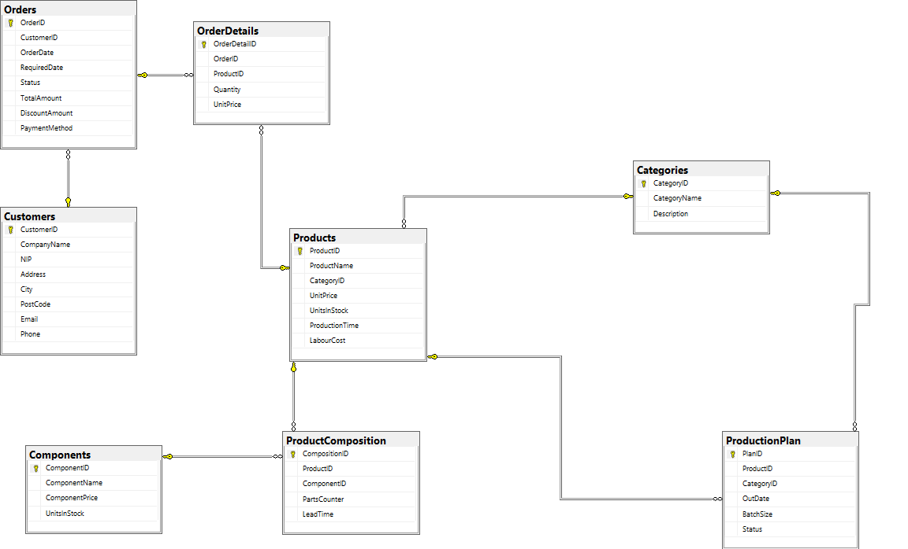

# Podstawy baz danych
pn 9:45\
nr zespołu: 21\
**Autorzy**: Iga Szaflik, Paweł Małkowski, Mikołaj Gaweł \
link

# 1. Wymagania i funkcje systemu
Zaimplementowana baza danych realizuje poniższe funkcje

**Produkcja:**
 - obliczanie kosztu prodkucji danego towaru
 - określenie czasu potrzebnego do produkcji
 - umożliwnienie dokonywania preorderów (zamawiania produktów przed ich wyprodukowaniam)
  
**Sprzedaż:**
- możliwość udzielenia rabatu
- rabat na zamówienia hurtowe
  
**Analiza:**
- wprowadza funkcje służące analizie danych


# 2. Baza danych

Nasza baza danych składa się/będzie się składać z następujących tabel:

**Produkty/Magazyn**:
 - Części do produkcji
 - Kategorie
 - Produkty
 - Skład produktu

**Sprzedaż**:
 - Klienci
 - Zamówienia
 - Szczegóły zamówienia

**Produkcja**:
 - Plan Produkcji

Implementacja struktur bazy danych:
```
-- Części do produkcji
CREATE TABLE Components (
    ComponentID INT IDENTITY(1,1) PRIMARY KEY,
    ComponentName NVARCHAR(100) NOT NULL,
    ComponentPrice DECIMAL(10,2) NOT NULL,
    UnitsInStock INT DEFAULT 0
);

-- Kategorie
CREATE TABLE Categories (
    CategoryID INT IDENTITY(1,1) PRIMARY KEY,
    CategoryName NVARCHAR(100) NOT NULL,
    Description NVARCHAR(100) NOT NULL
);

-- Produkty
CREATE TABLE Products (
    ProductID INT IDENTITY(1,1) PRIMARY KEY,
    ProductName NVARCHAR(100) NOT NULL,
    CategoryID INT FOREIGN KEY REFERENCES Categories(CategoryID),
    UnitPrice DECIMAL(10,2) NOT NULL,
    UnitsInStock INT DEFAULT 0,
    ProductionTime INT NOT NULL,
    LabourCost DECIMAL(10,2) DEFAULT 0
);

-- Skład produktu
CREATE TABLE ProductComposition (
    CompositionID INT IDENTITY(1,1) PRIMARY KEY,
    ProductID INT FOREIGN KEY REFERENCES Products(ProductID),
    ComponentID INT FOREIGN KEY REFERENCES Components(ComponentID),
    PartsCounter INT,
    LeadTime VARCHAR(200) -- czas od rozpoczęcia do zakończenia produkcji
);

-- Klienci
CREATE TABLE Customers (
    CustomerID INT IDENTITY(1,1) PRIMARY KEY,
    CompanyName NVARCHAR(200),
    NIP NVARCHAR(200),
    Address NVARCHAR(200),
    City NVARCHAR(200),
    PostCode NVARCHAR(200),
    Email NVARCHAR(200),
    Phone NVARCHAR(20)
);

-- Zamówienia
CREATE TABLE Orders (
    OrderID INT IDENTITY(1,1) PRIMARY KEY,    
    CustomerID INT FOREIGN KEY REFERENCES Customers(CustomerID),
    OrderDate DATETIME DEFAULT GETDATE(),
    RequiredDate DATETIME,
    Status VARCHAR(20) DEFAULT 'Pending' CHECK (Status IN ('Pending', 'In Production', 'Completed', 'Cancelled')), 
    TotalAmount DECIMAL(12,2),
    DiscountAmount DECIMAL(10,2) DEFAULT 0.00,
    PaymentMethod VARCHAR(50)
);

-- Szczegóły zamówienia
CREATE TABLE OrderDetails (
    OrderDetailID INT IDENTITY(1,1) PRIMARY KEY,
    OrderID INT FOREIGN KEY REFERENCES Orders(OrderID),
    ProductID INT FOREIGN KEY REFERENCES Products(ProductID),
    Quantity INT NOT NULL CHECK (Quantity > 0),
    UnitPrice DECIMAL(10,2) NOT NULL
);

-- Plan Produkcji
CREATE TABLE ProductionPlan (
    PlanID INT IDENTITY(1,1) PRIMARY KEY,
    ProductID INT FOREIGN KEY REFERENCES Products(ProductID),
    CategoryID INT FOREIGN KEY REFERENCES Categories(CategoryID),
    OutDate DATE,
    BatchSize INT,
    Status VARCHAR(20) DEFAULT 'Pending' CHECK (Status IN ('Pending', 'In Production', 'Completed'))
);
```

# 3. Schemat bazy
